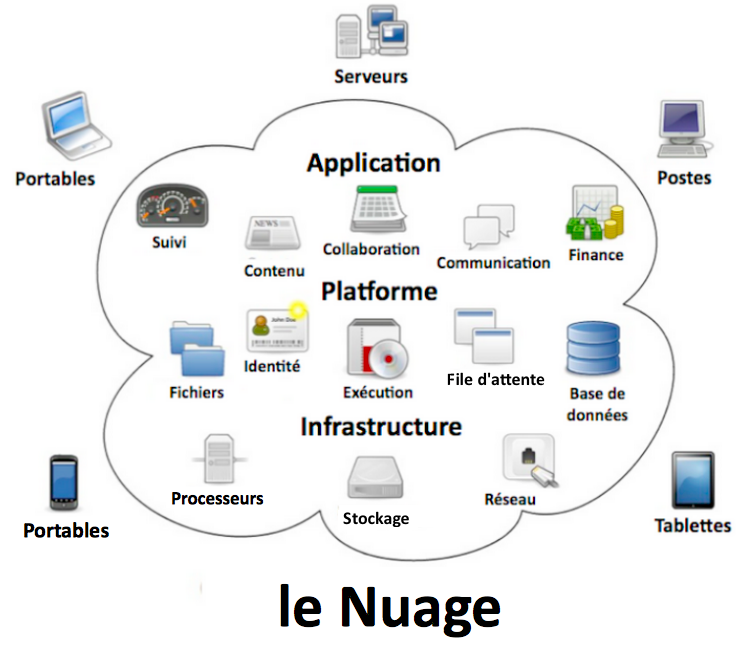

# LP-Cloud

	

Site de partage d'informations pour la réalisation d'un projet DevOps en **Licence Pro Admin Cloud - DevOps** <i>promo 21-22</i> à l'UHA.

Le projet mis en place consistera en la réalisation d'une application web {{à définir!}} utilisant les outils DevOps pour l'intégration et le déploiement continu et qui sera mise en dev/prod sur un ou plusieurs Cloud providers (GCP, Aws, Azure, etc...).
